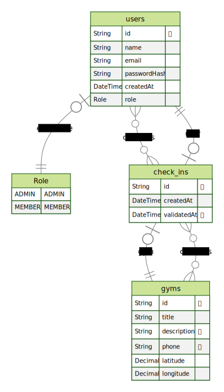

# Payment Gym

## Regra de Negócio (RNs)

- [ ] O usuário não deve poder se cadastrar com o e-mail duplicado;
- [ ] O usuário não pode fazer dois check-ins no mesmo dia;
- [ ] O usuário não pode fazer check-in se não estiver a 100m da academia;
- [ ] O check-in só pode ser validado 20 min após criado;
- [ ] O check-in só pode ser validado por administradores;
- [ ] A academia só pode ser cadastrada por administradores;

## Requisitos Funcionais (RFs)

- [ ] Deve ser possível: se cadastrar;
- [ ] Deve ser possível: se autenticar;
- [ ] Deve ser possível: obter o perfil de um usuário logado;
- [ ] Deve ser possível: obter o número de check-ins realizados pelo usuário logado;
- [ ] Deve ser possível: o usuário obter seu histórico de check-ins;
- [ ] Deve ser possível: o usuário buscar academias próximas;
- [ ] Deve ser possível: o usuário buscar academias pelo nome;
- [ ] Deve ser possível: o usuário realizar check-in em uma academia;
- [ ] Deve ser possível: validar o check-in de um usuário;
- [ ] Deve ser possível: cadastrar uma academia.

## Requisito Não Funcional (RNFs)

- [ ] A senha do usuário precisa estar criptografada;
- [x] Os dados precisam estar persistidos em um banco PostgreSQL;
- [ ] Todas listas de dados precisam estar paginadas com 20 itens por página;
- [ ] O usuário deve ser identificado por um JWT.

## ERD

